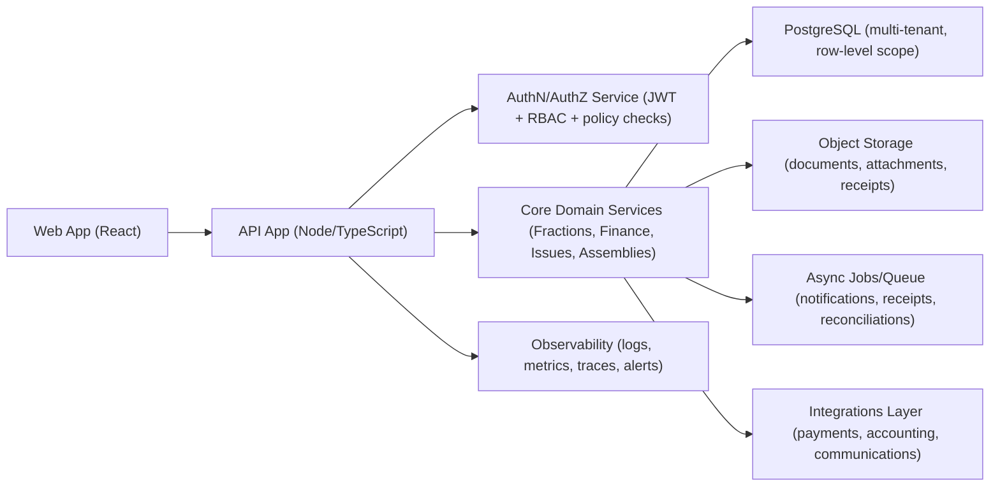

# Condoos - Produto, Arquitetura e Roadmap (Documento Vivo)

## Metadata

- Versao: `1.0`
- Data de criacao: `2026-02-13`
- Dono: `Product + CTO`
- Horizonte coberto: `0-24 meses`
- Proxima revisao: `2026-03-15`
- Cadencia de revisao: `mensal (operacional) + trimestral (estrategica)`

## 1. Visao

Construir o sistema operativo de referencia para gestao de condominios em Portugal, ligando operacao diaria, financeiro e governance numa unica plataforma confiavel, auditavel e simples de usar.

## 2. Tese de produto

### 2.1 Problema

Administracoes de condominio vivem entre folhas de calculo, email/WhatsApp, documentos dispersos e processos pouco auditaveis. Isso cria:

- baixa produtividade da equipa de gestao;
- erro operacional e financeiro;
- conflito com condominos por falta de transparencia;
- risco juridico e de compliance.

### 2.2 Proposta de valor

Condoos reduz friccao operacional em 3 fluxos criticos:

1. cobrar e reconciliar quotas com historico auditavel;
2. gerir ocorrencias de ponta a ponta (SLA, custos, evidencia);
3. executar assembleias e documentos com trilho de governance.

### 2.3 Segmento inicial (beachhead)

- Administradores profissionais pequenos/medios em Portugal (10-150 condominios sob gestao).
- Condominios autonomos com necessidade de digitalizacao basica.

## 3. Onde estamos hoje (analise do codigo)

### 3.1 Pontos fortes

- Frontend V1 funcional com cobertura ampla de modulos (`/Users/luislaginha/Library/CloudStorage/Dropbox/Condoos/src/App.jsx`).
- UX operacional forte para demo: quick actions, command palette, centro de alertas, RBAC visual, exportacao CSV.
- Dataset sintetico consistente para QA (`/Users/luislaginha/Library/CloudStorage/Dropbox/Condoos/data/synthetic/condominio_portugal_seed.json`).
- Base backend inicial criada com auth/JWT, RBAC server-side, multi-tenant por `x-tenant-id`, audit log e SQLite (`/Users/luislaginha/Library/CloudStorage/Dropbox/Condoos/backend/server.js`).

### 3.2 Lacunas criticas

- Frontend ainda nao integrado com API (mantem `localStorage` como fonte principal).
- Monolito de UI em ficheiro unico (`src/App.jsx` com ~4k linhas), elevando risco de regressao e baixa velocidade de evolucao.
- Sem testes automaticos (unit, integration, e2e) e sem pipeline CI.
- Stack de dados ainda local (SQLite) adequada a bootstrap, mas insuficiente para escala multi-cliente.
- Nao existe observabilidade de producao (metricas, tracing, alertas).
- Fluxos financeiros incompletos para operacao real (recibos PDF robustos, reconciliacao bancaria, ledger imutavel).

### 3.3 Conclusao de maturidade

Produto em fase `Prototype+` com alto valor demonstravel e base tecnica inicial para migrar para `Pilot-ready` em 3-4 meses, se foco for disciplinado no core financeiro + confiabilidade.

## 4. Principios orientadores

1. Sistema de registo unico: backend e base de dados como fonte de verdade.
2. Financeiro primeiro: tudo que afeta dinheiro precisa de trilho auditavel.
3. Multi-tenant por default: isolamento logico em todas as camadas.
4. Compliance by design: RGPD e governance como requisito de arquitetura, nao add-on.
5. Simplicidade operacional: menos cliques e menos tempo por tarefa critica.
6. Entrega incremental com qualidade: cada sprint entrega valor utilizavel + testes.

## 5. Arquitetura alvo (12-24 meses)

### 5.1 Decisoes de stack (guideline)

- Curto prazo: manter Node + Express, migrar gradualmente para TypeScript.
- Dados: migrar de SQLite para PostgreSQL antes de pilotos pagos.
- Jobs assincros: fila para tarefas de comunicacao, PDF, reconciliacao e imports.
- Documentos: storage dedicado com versionamento e controlo de acesso.

### 5.2 Contratos de dominio obrigatorios

- Encargos/pagamentos com ledger auditavel (append-friendly, sem perda de historico).
- Estados de ocorrencias e assembleias com maquina de estados explicita.
- Politicas RBAC + tenant scope aplicadas no backend para todos os endpoints.

## 6. Roadmap estrategico

## Horizonte A - `Foundation to Pilot` (0-4 meses, ate 30 de junho de 2026)

Objetivo: sair de demo funcional para produto piloto com 3-5 clientes iniciais.

Entregas:

- Integrar frontend com API para modulos core (dashboard, fracoes, financeiro, ocorrencias).
- Refatorar frontend em modulos (state/query layer + componentes por dominio).
- Completar Sprint 0-3 do backlog com enforcement server-side real.
- Implementar testes minimos:
  - unit para regras financeiras e permissao,
  - integration API para fluxos CRUD core,
  - e2e para 5 jornadas criticas.
- Implementar observabilidade basica (erro, latencia, logs estruturados).
- Hardening de seguranca:
  - rotacao de segredos,
  - rate limit,
  - politica de sessao e refresh token,
  - backups automatizados.

Gate de saida (Definition of Pilot Ready):

- >= 95% das operacoes criticas passam em testes automatizados.
- sem P0/P1 aberto em financeiro/auth.
- tempos API p95 < 500ms nas rotas core.

## Horizonte B - `Pilot to Product-Market Fit` (4-9 meses, julho-novembro de 2026)

Objetivo: provar retencao e valor economico por condominio.

Entregas:

- Financeiro real:
  - emissao de recibos PDF,
  - reconciliacao semiautomatica,
  - exportes contabilisticos.
- Documentos e governance:
  - workflow de convocatorias/atas versionadas,
  - permissoes por perfil e entidade.
- Portal do condomino com self-service real (pagamentos, recibos, ocorrencias, documentos).
- Integracoes prioritarias:
  - pagamentos (MB Way/Multibanco/SEPA),
  - comunicacoes (email first; SMS/WhatsApp faseada).
- Medicao de produto em producao (ativacao, uso por papel, tempo por tarefa).

Gate de saida (PMF signal):

- Retencao logo apos 90 dias >= 85% nos pilotos.
- > 60% dos condominos ativos mensalmente no portal (onde portal foi lancado).
- reducao mensuravel de carga operacional por administrador.

## Horizonte C - `Scale` (9-24 meses, dezembro de 2026 em diante)

Objetivo: escalar com previsibilidade comercial e robustez tecnica.

Entregas:

- Arquitetura para escala (PostgreSQL production-grade, queue robusta, tenancy hardening).
- Suite de compliance empresarial (RGPD operacional, retention policies automatizadas).
- Camada de integracoes contabilisticas e APIs externas padronizadas.
- Inteligencia operacional:
  - deteccao de risco de atraso,
  - priorizacao de ocorrencias por impacto/custo/SLA.
- Modelo de pricing e packaging por segmento (SaaS + addons de integracao/compliance).

## 7. Objetivos e metricas

## 7.1 North Star

`Condominios geridos com fecho financeiro mensal completo e auditavel dentro do prazo.`

## 7.2 KPIs de negocio

- Ativacao:
  - tempo ate onboarding completo do condominio (target: < 2h).
- Valor:
  - tempo para emitir quota (target: < 60s).
  - tempo para abrir/classificar ocorrencia (target: < 45s).
- Retencao:
  - condominio ativo mensal (MAA) por segmento.
- Receita:
  - MRR e net revenue retention por coorte.
- Qualidade:
  - churn de condominios,
  - NPS de administradores e condominos.

## 7.3 SLOs tecnicos

- Disponibilidade API: `>= 99.5%` (horizonte A), `>= 99.9%` (horizonte C).
- Latencia p95 rotas core: `< 500ms` (horizonte A), `< 300ms` (horizonte C).
- RPO backup: `<= 24h` (A), `<= 1h` (C).
- RTO incidente severo: `<= 8h` (A), `<= 1h` (C).

## 8. Plano de execucao 30/60/90 dias

Nota: o plano detalhado dos proximos 30 dias esta em `docs/product/PLAN-30-DIAS-FOUNDATION.md`.

## 0-30 dias

- Fechar integracao API no frontend para auth/dashboard/fractions/charges/issues.
- Criar camada `api client + auth session + tenant context`.
- Definir esquema de erro padrao e tracing request-id.
- Criar pipeline CI minima com build + lint + testes smoke.

## 31-60 dias

- Refatorar `src/App.jsx` em modulos de dominio.
- Implementar testes unitarios (regras financeiras + RBAC) e integration API.
- Introduzir migracoes de base de dados e seeds reproduziveis.
- Endurecer seguranca de autenticacao (refresh tokens + revogacao).

## 61-90 dias

- E2E dos fluxos criticos (gestao e condomino).
- Primeira versao de recibo PDF e export contabilistico.
- Monitorizacao operacional e runbooks de incidente.
- Preparacao de pilotos com ambiente staging.

## 9. Modelo de governance do produto

## 9.1 Ritual de decisao

- Semanal: review de entrega (produto + engenharia + operacoes).
- Quinzenal: review de roadmap por resultados (nao por output).
- Mensal: review de metricas de negocio e qualidade.
- Trimestral: revisao estrategica (manter rumo, ajustar ou pivotar).

## 9.2 Regras para alterar rumo

Pivot de estrategia so acontece quando pelo menos 2 condicoes se confirmam por 2 ciclos consecutivos:

- falha material de retencao (abaixo da meta acordada);
- CAC payback fora do limite target;
- bloqueio regulatorio/compliance que invalida abordagem atual;
- custo tecnico de manutencao a comprometer roadmap de negocio.

## 9.3 Registo de decisao

Cada decisao estruturante deve gerar ADR (Architecture Decision Record) com:

- contexto;
- opcoes avaliadas;
- decisao;
- impacto esperado;
- criterio de reavaliacao.

## 10. Riscos principais e mitigacao

1. Risco: produto tenta resolver tudo ao mesmo tempo.
Mitigacao: foco em 3 jobs-to-be-done (cobranca, ocorrencias, assembleias).

2. Risco: divida tecnica do frontend desacelera equipa.
Mitigacao: modularizacao orientada a dominio + testes antes de novas features largas.

3. Risco: financeiro sem robustez suficiente para confianca comercial.
Mitigacao: ledger auditavel, reconciliacao e validacao contabilistica incremental.

4. Risco: dependencia de integracoes externas.
Mitigacao: camada de adaptadores e estrategia de fallback por provider.

5. Risco: falha de seguranca/compliance em fase piloto.
Mitigacao: baseline de seguranca, revisoes periodicas e controlos de acesso end-to-end.

## 11. Changelog do documento

| Versao | Data       | Mudanca                                                   | Autor         |
|--------|------------|-----------------------------------------------------------|---------------|
| 1.0    | 2026-02-13 | Criacao do documento base de visao, arquitetura e roadmap | Product + CTO |
